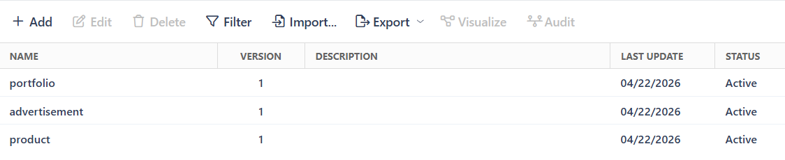
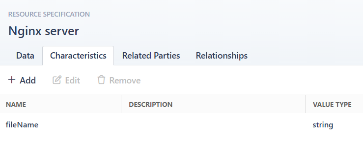

CxO TMF Provisioning Project
Project Overview
This project demonstrates the end-to-end automation and orchestration of web hosting services. By leveraging TM Forum Open APIs and Codaxy Orchestrator (CxO), the system allows for the modeling, ordering, and automated deployment of containerized static web pages.

Key Features
TMF-Compliant Modeling: Full implementation of Service/Resource Catalogs, Categories, and Specifications using TMF standards.

Automated Provisioning: Workflow-driven deployment that validates input, handles local storage, and launches NGINX containers via Docker.

Dynamic Notification: Automatic email delivery to the end-user with the unique URL of the provisioned service.

Tech Stack
Orchestration: Codaxy Orchestrator (CxO)

Standards: TM Forum Open APIs (TMF641, TMF633, TMF634)

Web Server: NGINX (Dockerized)

Backend/Logic: .NET / Docker


Configuration:
1. Clone and start cxo composer repository: https://github.com/codaxy/cxo-composer.git
2. Set up the admin portal
    #### Service specifications: 
    #### Portfolio characteristics: 
    ```    
        linkedinUrl		string		
        bio		string		
        githubUrl		string		
        profileImage		string		
        name		string		
        skill3		string		
        templateId		string		
        title		string		
        skill4		string		
        skill2		string		
        projects		array		
        email		string		^[^@\s]+@[^@\s]+\.[^@\s]+$
        skill1		string		
        categoryId		string		
        accentColor		string
    ```	
    #### Adverstiment characteristics:
    ```
        logoUrl		string		
        feature1		string		
        headline		string		
        ctaUrl		string		
        templateId		string		
        ctaText		string		
        feature3		string		
        brandColor		string		
        bgColor		string		
        feature2		string		
        description		string		
        categoryId		string		
        email		string		
        accentColor		string		
        subheadline		string		
        heroImage		string
    ```
    #### Product characteristics:
    ```
        templateId		string		
        buyUrl		string		
        accentColor		string		
        feature3Desc		string		
        spec3		string		
        ctaUrl		string		
        feature1Desc		string		
        spec2		string		
        feature2Title		string		
        categoryId		string		
        feature1Title		string		
        spec1		string		
        productImage		string		
        email		string		
        price		string		
        tagline		string		
        description		string		
        feature2Desc		string		
        primaryColor		string		
        feature3Title		string		
        heroImage		string		
        ctaText		string		
        productName		string		
        buyUrl		string
    ```
    #### Resource: 

    #### Service workflow maps:
    ```
        ADD	portfolio	ValidationWorkflow	som_gen_chk_fsblty	ProvisioningServiceWorkflow	som_gen_prep_rb	som_gen_chk_fsblty_rb	som_gen_flfll_rb	som_gen_cancel
        ADD	advertisement	ValidationWorkflow	som_gen_chk_fsblty	ProvisioningServiceWorkflow	som_gen_prep_rb	        som_gen_chk_fsblty_rb	som_gen_flfll_rb	som_gen_cancel
        ADD	product	ValidationWorkflow	som_gen_chk_fsblty	ProvisioningServiceWorkflow	som_gen_prep_rb	        som_gen_chk_fsblty_rb	som_gen_flfll_rb	som_gen_cancel
    ```
    #### Resource workflow maps:
    ```
        ADD	Nginx server	rom_gen_prep	rom_gen_chk_fsblty	DeployPageWorkflow	rom_gen_cancel
    ```